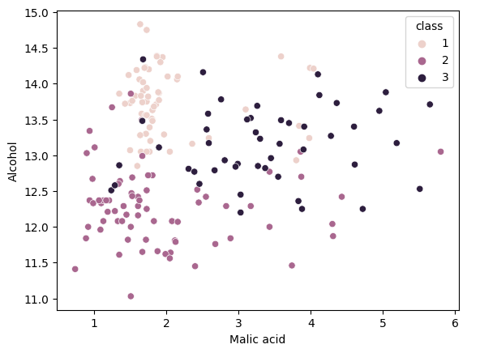

# 📊 Data Visualization - Kaggle Learn

Este repositorio contiene los ejercicios y proyecto final realizados durante el curso **"Data Visualization"** de Kaggle, una introducción práctica al uso de Python y la librería `seaborn`y `matplotlib para visualizar datos de manera efectiva.

---
## 🧠 Contenido del curso

El curso constó de **6 lecciones** teórico-prácticas y **1 proyecto final**, donde se abordaron los siguientes temas:

1. **Hello Seaborn**  
   Introducción a la codificación para visualización de datos usando `seaborn` y `matplotlib`.

2. **Line Charts**  
   Visualización de tendencias a lo largo del tiempo con gráficos de línea.

3. **Bar Charts and Heatmaps**  
   Comparación de categorías mediante gráficos de barras y mapas de calor.

4. **Scatter Plots**  
   Exploración de relaciones entre variables usando coordenadas cartesianas.

5. **Distributions**  
   Uso de histogramas y gráficos de densidad para visualizar la distribución de variables.

6. **Choosing Plot Types and Custom Style**  
   Selección del tipo de gráfico adecuado y personalización del estilo visual.

---

## 🧪 Proyecto final

Se eligió el dataset público de Kaggle [`Wine Dataset`](https://www.kaggle.com/datasets/tawfikelmetwally/wine-dataset), y se elaboró el siguiente gráfico como parte del análisis exploratorio:

Este ejercicio permitió visualizar la relación entre la acidez málica y el nivel de alcohol por clase de vino.

---

## 🧾 Certificación

Este curso forma parte de mi preparación para roles en análisis de datos, reforzando competencias en visualización con Python, fundamentales para la comunicación efectiva de resultados.

---

## 📄 Licencia

Este proyecto está bajo la Licencia MIT.
